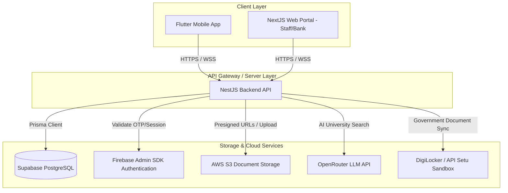

# VidyaLoan Project Architectural Blueprint

Welcome to the **VidyaLoan (EduLoan) Project Blueprint**. This document provides a comprehensive technical overview of the system architecture, file structure, API endpoints, database models, and integrations across the mobile application and the NestJS backend.

---

## 1. System Architecture Overview

The application utilizes a decoupled, cloud-centric service architecture designed to assist students in analyzing university profiles, managing educational loan workflows, and storing digital documents.



---

## 2. Directory Layout & Module Structure

The project code is divided into two primary workspaces: the Flutter mobile client (`lib/`) and the NestJS server (`api-backend/server/`).

### Flutter Client Folder Structure (`/lib`)
* **`main.dart`**: Main entrypoint setting up route observers, notification listeners, and base theme providers.
* **`pages/`**:
  * `auth/`: OTP verification, phone number login, and profile photo setup.
  * `ai_tools/`: `university_shortlisting_page.dart` (dynamic questionnaire flow for Bachelors and Masters plans, recommendation views).
  * `loans/`: Loan application stepper, calculator, and status trackers.
  * `notifications_page.dart`: Mobile notification center displaying push notifications and read/unread counters.
* **`services/`**:
  * `api_config.dart`: Holds the active base URL mapping for real production endpoints (`https://appv1.vidyaloans.in/api`).
  * `ai_logic_service.dart`: Client-side API wrappers for shortlists, global searches, and callbacks.
  * `notification_service.dart`: Pulls read/unread status updates from the NestJS REST routes.

### NestJS Backend Folder Structure (`/api-backend/server/src`)
* **`auth/`**:
  * `firebase-auth.service.ts`: Performs certificate-based validation of Firebase OTP tokens, with regex self-healing properties for missing escape sequences in production private keys.
  * `email.service.ts`: Sends high-fidelity templates (welcoming, otp, statuses, reminders) and builds PDF kit document layouts.
* **`document/`**:
  * `document.controller.ts`: Manages secure digital lockers and uploads.
  * `s3.service.ts`: Wraps AWS S3 SDK for generating time-limited presigned file links.
* **`ai/`**:
  * `ai.controller.ts`: Hosts global university queries (`/search-universities`) mapped automatically to undergraduate (`ug_university`) or master's (`university`) scopes.
* **`notification/`**:
  * `notification.service.ts`: Interfaces directly with Supabase to read/write event logs and broadcasts realtime payloads.
* **`university/`**:
  * `university-inquiry.service.ts`: Handles requests for human counselor callbacks and fast-track entries.

---

## 3. Database Schema Overview (Supabase PostgreSQL)

Below are the primary relational entities configured via Prisma.

### User
Tracks student accounts, profile pictures, and contact details.
```prisma
model User {
  id             String        @id @default(uuid())
  phone          String        @unique
  email          String?       @unique
  fullName       String?
  profileImage   String?       // URL pointing to S3 or Firebase storage
  role           String        @default("student") // student, staff, admin, bank
  createdAt      DateTime      @default(now())
  updatedAt      DateTime      @updatedAt
}
```

### UniversityInquiry
Stores requests made by guest or authenticated users to fast-track applications or request callback support.
```prisma
model UniversityInquiry {
  id             String   @id @default(uuid())
  userId         String?  // References User.id (Nullable for guest submissions)
  name           String
  email          String
  mobile         String
  universityName String
  type           String   // 'callback' or 'fasttrack'
  status         String   @default("pending")
  createdAt      DateTime @default(now())
  updatedAt      DateTime @updatedAt
}
```

### Notification
Tracks read/unread events per user, broadcasted locally to the mobile app's bell center.
```prisma
model Notification {
  id             String   @id
  userId         String   // References User.id, 'all', or 'staff'
  title          String
  body           String
  type           String   // loanUpdate, communityMessage, offer, system
  isRead         Boolean  @default(false)
  timestamp      DateTime @default(now())
  metadata       Json?
}
```

---

## 4. Key API Endpoints & Routes

All routes are prefixed by `/api` and run over HTTPS.

| Endpoint | Method | Guard | Description |
| :--- | :--- | :--- | :--- |
| `/auth/verify-otp` | `POST` | Public | Validates SMS verification codes. |
| `/auth/profile/update` | `PUT` | UserGuard | Updates profile properties including `profileImage` persistence. |
| `/ai/search-universities` | `POST` | Public | AI-augmented search for degree plans (bachelors/masters). |
| `/university-inquiry` | `POST` | Public | Inserts callback and fast-track leads. |
| `/notifications` | `GET` | UserGuard | Fetches unread notification lists. |
| `/notifications/:id/read` | `PUT` | UserGuard | Marks individual notifications as read. |
| `/notifications/mark-all-read`| `PUT` | UserGuard | Marks all notification histories as read. |
| `/document/upload` | `POST` | UserGuard | Requests S3 upload targets for file uploads. |

---

## 5. Third-Party Integrations

1. **Firebase Admin (Authentication)**: Integrates directly with cellular network carriers to issue and verify OTP codes, ensuring high delivery rates and fast user onboarding.
2. **OpenRouter AI Engine**: Forwards context lists (Academic status, CGPA, target countries) to language models (e.g. GPT-4o-Mini / Llama) to dynamically extract custom university lists.
3. **AWS S3 Cloud Buckets**: Provides distributed storage for KYC files, university admit letters, and financial tax document submissions.
4. **DigiLocker API / API Setu**: Supports instant sync of government certificates (PAN cards, Aadhar details, transcripts) into the student's digital document vault.
